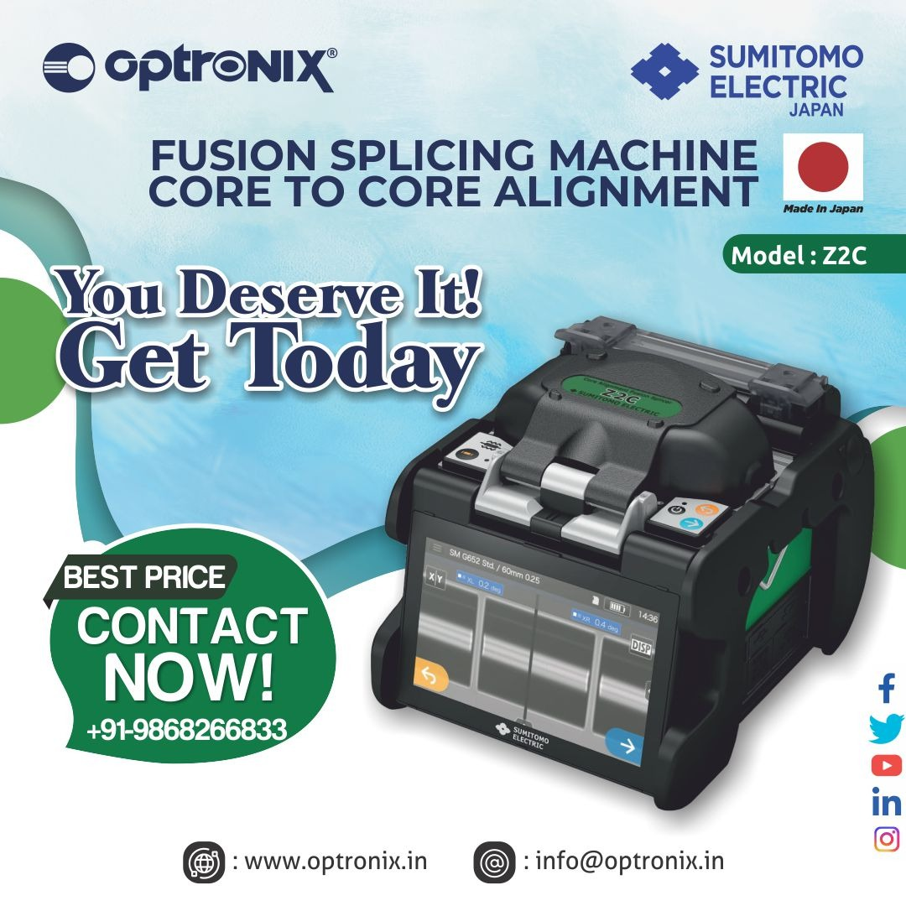

# Sumitomo Splicing Machine

Sumitomo Electric Industries, Ltd. \(SEI\), incorporated in 1897,is a Sumitomo Group company which is carrying on the Sumitomo Business Spirit cultivated through 400 Years. SEI undertakes operations on global scale in five main areas : automotive,information & communication ; electronics ; electric wire and cable, energy, industrial materials. Through its provision of products and services responding to the demands of customers and all society, SEI aims to be an excellent company recognized and solidly trusted by the global community.

High Definition Core Aligning Fusion Splicer-82C+’s 5 inch LCD monitor with touch screen operation enables to confirm fiber images easily. The Sumitomo splicer can be operated by touching the icons on the screen.

